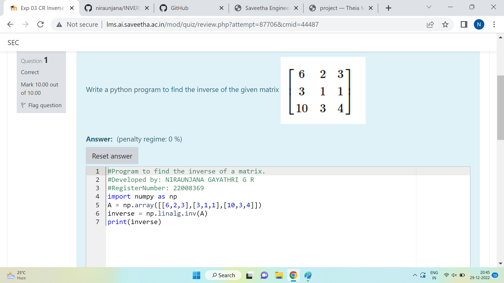

# INVERSE-OF-A-MATRIX
## Aim:
To write a python program to find the inverse of a matrix
## Equipment’s required:
1. 	Hardware – PCs
2. 	Anaconda – Python 3.7 Installation / Moodle-Code Runner
## Algorithm:
### Step1 :
import the numpy module to use the built-in functions for calculation 
### Step 2: 
Prepare the lists from each linear beqy=uations and assign in np.array()
### Step 3: 
Using the np.linalg.inv(),we can find the rank of the given matrix.
### Step 4: 
End the Program.

## Program:

```python
#Program to find the inverse of a matrix.
#Developed by: NIRAUNJANA GAYATHRI G R
#RegisterNumber: 22008369
import numpy as np
A = np.array([[6,2,3],[3,1,1],[10,3,4]])
inverse = np.linalg.inv(A)
print(inverse)
```

## Output:

## Result:
Thus the inverse of given matrix is successfully solved using python program

